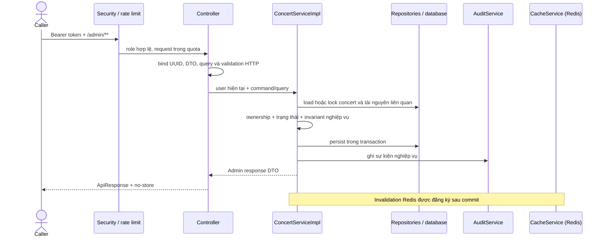

# Hướng dẫn review: Concert, SeatZone và TicketType cho ADMIN/ORGANIZER

## Mục tiêu và phạm vi

Thay đổi bổ sung bộ API quản trị Catalog cho ADMIN và ORGANIZER: danh sách/tạo/sửa/publish/cancel concert, tạo/sửa seat zone và tạo/sửa ticket type. ORGANIZER bị giới hạn theo `organizer_id`; ADMIN có thể quản lý concert của mọi organizer. Các API public trong `CatalogController` giữ nguyên. Phần spec Admin ở `blueprint/api-design/catalog-api.md` được cập nhật để mô tả contract và cache Redis; không có CDN trong luồng này.

Đây là hướng dẫn review code trong workspace hiện tại. `git status` còn có nhiều thay đổi frontend và MinIO ngoài phạm vi API Catalog. Các thay đổi đó không được mô tả như một phần của implementation này; nên review theo nhóm file backend Catalog/Security/cache và spec được liệt kê dưới đây. Workspace đã có trạng thái thay đổi trước đó, vì vậy cần kiểm tra lịch sử hoặc diff nền nếu cần xác định chính xác tác giả của từng thay đổi.

## Bắt đầu review

1. Đọc contract tại [catalog-api.md](blueprint/api-design/catalog-api.md), tập trung vào phần Admin: endpoint, trạng thái, quyền, PATCH semantics, lỗi và retry.
2. Đọc controller để đối chiếu đường dẫn, HTTP method, tham số, status code và envelope response.
3. Đọc `ConcertServiceImpl` theo các flow bên dưới; đây là nơi thực thi ownership, chuyển trạng thái, khóa dữ liệu, validation và audit.
4. Đối chiếu DTO/entity/repository với schema `backend/src/main/resources/db/migration/V1__init_schema.sql`.
5. Cuối cùng đọc Security, rate limit, Problem Detail, cache và tests để xác minh hành vi bao quanh service.

## Các file chính và trách nhiệm

| Nhóm | File | Điểm cần review |
| --- | --- | --- |
| HTTP | `backend/src/main/java/com/ticketbox/api/module/catalog/controllers/ConcertController.java` | `GET/POST /admin/concerts`, `PATCH /{concertId}`, publish/cancel và create seat zone/ticket type; role gate, query validation, pagination, cache-control. |
| HTTP | `backend/src/main/java/com/ticketbox/api/module/catalog/controllers/SeatZoneController.java` | `PATCH /admin/seat-zones/{seatZoneId}`. |
| HTTP | `backend/src/main/java/com/ticketbox/api/module/catalog/controllers/TicketTypeController.java` | `PATCH /admin/ticket-types/{ticketTypeId}`. |
| Use case | `backend/src/main/java/com/ticketbox/api/module/catalog/services/ConcertService.java` | Hợp đồng các thao tác quản trị Catalog. |
| Use case | `backend/src/main/java/com/ticketbox/api/module/catalog/services/ConcertServiceImpl.java` | Logic nghiệp vụ, ownership, state transition, transaction, lock, audit và invalidation. Đây là file trọng tâm. |
| Request DTO | `backend/src/main/java/com/ticketbox/api/module/catalog/domain/dtos/CreateConcertRequest.java`, `UpdateConcertRequest.java`, `CreateSeatZoneRequest.java`, `UpdateSeatZoneRequest.java`, `CreateTicketTypeRequest.java`, `UpdateTicketTypeRequest.java`, `CancelConcertRequest.java` | Validation request; update DTO ghi nhận field đã gửi để phân biệt omitted với `null`; request từ chối field không hỗ trợ. |
| Response/time | `backend/src/main/java/com/ticketbox/api/module/catalog/domain/dtos/AdminConcertResponse.java`, `AdminSeatZoneResponse.java`, `AdminTicketTypeResponse.java`, `Rfc3339UtcLocalDateTimeDeserializer.java`, `UnknownAdminField.java` | Response dành cho admin, parse thời gian có offset và lỗi field lạ. Kiểm tra không làm thay đổi DTO public hiện có. |
| Domain/repository | `backend/src/main/java/com/ticketbox/api/module/catalog/domain/entities/ConcertStatus.java`; `backend/src/main/java/com/ticketbox/api/module/catalog/repositories/ConcertRepository.java`, `SeatZoneRepository.java`, `TicketTypeRepository.java` | Trạng thái `CANCELLED` và truy vấn/khóa phục vụ ownership, uniqueness, inventory totals. |
| Bảo mật | `backend/src/main/java/com/ticketbox/api/infrastructure/config/SecurityConfig.java` | Quyền ADMIN/ORGANIZER trên route Admin và phản hồi 401/403. |
| Lỗi | `backend/src/main/java/com/ticketbox/api/module/catalog/controllers/AdminCatalogExceptionHandler.java`; `backend/src/main/java/com/ticketbox/api/infrastructure/response/AdminProblemWriter.java` | Problem Detail cho lỗi request Catalog và lỗi security/filter liên quan Admin. |
| Rate limit | `backend/src/main/java/com/ticketbox/api/module/catalog/config/CatalogAdminRateLimitPolicy.java`; `backend/src/main/java/com/ticketbox/api/infrastructure/rateLimit/RateLimitFilter.java` | Giới hạn request đọc/ghi trên Admin routes và cách phản hồi khi rate limit backend lỗi. |
| Cache | `backend/src/main/java/com/ticketbox/api/module/shared/cache/CacheService.java`; `backend/src/main/resources/application.yml` | Invalidation Redis cho dữ liệu Admin và cấu hình timezone persistence. Không có CDN invalidation. |
| Kiểm thử | `backend/src/test/java/com/ticketbox/api/module/catalog/services/AdminConcertServiceTest.java`, `backend/src/test/java/com/ticketbox/api/infrastructure/config/JacksonConfigTest.java` | Quy tắc nghiệp vụ được kiểm thử và parse JSON/time. Tên test service vẫn dùng tên cũ. |
| Contract | `blueprint/api-design/catalog-api.md` | Spec đích cho API Admin; public contract được để nguyên. |

## Bản đồ endpoint

| Method | Endpoint | Controller method |
| --- | --- | --- |
| GET | `/admin/concerts` | `ConcertController.getConcerts` |
| POST | `/admin/concerts` | `ConcertController.createConcert` |
| PATCH | `/admin/concerts/{concertId}` | `ConcertController.updateConcert` |
| POST | `/admin/concerts/{concertId}/publish` | `ConcertController.publishConcert` |
| POST | `/admin/concerts/{concertId}/cancel` | `ConcertController.cancelConcert` |
| POST | `/admin/concerts/{concertId}/seat-zones` | `ConcertController.createSeatZone` |
| PATCH | `/admin/seat-zones/{seatZoneId}` | `SeatZoneController.updateSeatZone` |
| POST | `/admin/concerts/{concertId}/ticket-types` | `ConcertController.createTicketType` |
| PATCH | `/admin/ticket-types/{ticketTypeId}` | `TicketTypeController.updateTicketType` |

Các controller áp dụng `hasAnyRole('ORGANIZER', 'ADMIN')`. Phân quyền trên đối tượng không kết thúc ở role gate: service kiểm tra concert cha và ownership. Tạo concert gán organizer từ user đang đăng nhập, kể cả khi caller là ADMIN; request không chọn/chuyển organizer.

## Luồng xử lý

Các lỗi xác thực/role được trả trước khi service chạy. Lỗi cú pháp, query hoặc UUID xử lý ở lớp web; lỗi nghiệp vụ như không tìm thấy, sai owner, trạng thái không hợp lệ hoặc trùng dữ liệu phát sinh trong service/repository và được chuyển thành response lỗi. Thao tác ghi khóa concert để phối hợp các thay đổi inventory/capacity, lưu thay đổi trong transaction, sau đó mới invalidate Redis.

## Hướng dẫn review theo flow

### 1. Danh sách và quyền truy cập

Trong `ConcertController.getConcerts`, kiểm tra allowlist query (`status`, `q`, `page`, `size`, `sortBy`, `sortOrder`), giới hạn `page >= 0`, `1 <= size <= 100`, sort field cho phép `createdAt`, `startsAt`, `title`, thứ tự `asc|desc`, và sort phụ `id ASC` để pagination ổn định. Mặc định là trang 0, size 20, `createdAt DESC`.

Trong `ConcertServiceImpl.getConcerts`, xác nhận ORGANIZER chỉ thấy concert có `organizer_id` bằng caller; ADMIN không bị giới hạn owner. Không truyền status nghĩa là lấy mọi trạng thái trong phạm vi đó. Kiểm tra alias `CANCELLED` được chấp nhận khi lọc và response chuẩn hóa thành `CANCELED`. `q` nên được escape để ký tự wildcard không làm thay đổi ý nghĩa tìm kiếm.

### 2. Tạo và cập nhật concert

Tạo mới phải khởi tạo trạng thái `DRAFT`, dùng organizer của caller, kiểm tra field bắt buộc/độ dài, venue là string, slug unique, và thời gian bắt đầu/kết thúc hợp lệ. Kiểm tra mapping tiền theo `NUMERIC(12,2)` và currency riêng theo DTO/entity/schema. Sau khi lưu, service ghi audit và lên lịch invalidation Redis sau commit.

PATCH cần được review kỹ với ba trường hợp cho từng field: không gửi field (giữ nguyên), gửi giá trị (thay đổi), gửi `null` (chỉ xóa nếu field nullable). Service hợp nhất giá trị mới với entity trước khi kiểm tra tính hợp lệ của khoảng thời gian; vì vậy PATCH một đầu mốc thời gian vẫn phải hợp lệ với đầu mốc còn lại. Field server-managed/không hỗ trợ bị từ chối. `slug`, mã zone, quan hệ cha và currency cần giữ nguyên theo contract. No-op không nên tạo audit/invalidation thừa.

### 3. Publish và cancel

Publish cần lock concert, xác minh owner, và chỉ cho phép transition `DRAFT -> PUBLISHED`. Gọi lại trên `PUBLISHED` trả response thành công mà không chạy lại side effect. Trước chuyển trạng thái, kiểm tra có ít nhất một zone và một ticket type, sale window hợp lệ, tổng quantity mỗi zone không vượt capacity. Kiểm tra ticket type `DRAFT` được chuyển `ON_SALE` theo contract, nhưng cửa sổ bán vẫn là điều kiện riêng.

Cancel chỉ chấp nhận từ `DRAFT`/`PUBLISHED`; trạng thái đã hủy gọi lại thành công mà không lặp audit/invalidation. `reason` được lưu trong metadata audit, không phải cột Concert. Cancel không refund, không sửa held/sold, và không tự thay đổi trạng thái ticket type. Đây là hành vi cần đối chiếu với yêu cầu sản phẩm: order flow hiện kiểm tra ticket type `ON_SALE` và sale window nhưng không kiểm tra trạng thái Concert, nên concert bị cancel có thể vẫn cho phép checkout nếu ticket type còn bán. Đây là giới hạn đáng kiểm tra hoặc tách thành thay đổi tiếp theo nếu cancel phải dừng bán ngay.

### 4. Seat zone và capacity

Các thao tác trên zone cần xác định concert cha, khóa concert và thực thi ownership qua cha. Zone phải thuộc đúng concert; code unique trong phạm vi dự kiến và được chuẩn hóa nhất quán; capacity dương. Khi giảm capacity hoặc tạo/sửa ticket type, tổng vé đã cấp cho zone không được vượt capacity. Zone cha/código không được chuyển sau tạo theo contract. Chú ý response/error khi ID zone tồn tại nhưng thuộc concert khác: không để việc biết ID làm lộ dữ liệu ngoài quyền của caller.

### 5. Ticket type và inventory

Tạo ticket type phải kiểm tra zone thuộc concert trong path, tên không trùng theo phạm vi unique, enum đủ sáu giá trị schema, price không âm tối đa hai chữ số thập phân, `total_quantity >= 0`, `max_per_user >= 1`, sale window hợp lệ và capacity còn lại của zone. Bộ đếm held/sold khởi đầu từ 0; available được tính, không nhận từ client.

PATCH cần từ chối thay đổi trực tiếp `held_quantity`, `sold_quantity`, `available_quantity`; kiểm tra `total_quantity >= held_quantity + sold_quantity`; xác minh zone không đổi và tổng vé zone sau cập nhật vẫn trong capacity. Cập nhật ticket type phải khóa concert cha trước rồi mới lock ticket type để giảm nguy cơ race/deadlock với flow tạo vé. Review thứ tự lock này cùng transaction boundaries trong order service.

## Lỗi, rate limit và cache

`AdminCatalogExceptionHandler` chuyển `AppException` thành Problem Detail, lỗi DTO validation thành 422, lỗi parse body/type thành 400; `UnknownAdminField` được DTO dùng để báo field không hỗ trợ. `AdminProblemWriter` được dùng cho 401/403/429/503 ở filter/security. Khi review, đối chiếu mã lỗi/status với error catalog trong spec và đảm bảo public error behavior không bị thay đổi ngoài ý muốn.

Rate limit được cấu hình riêng cho Catalog Admin. Xác nhận GET có chính sách fail-open theo cấu hình, còn write fail-closed; phân biệt 429 (đã vượt quota) và 503 (không thể áp dụng chính sách ghi). Các phản hồi Admin dùng `Cache-Control: no-store`.

`CacheService.invalidateAdminConcert` xóa key Redis theo pattern `concerts:{concertId}*` và các key tổng `concerts:all*`. Invalidation được thực hiện sau commit để tránh xóa cache khi transaction rollback. Có tối đa ba lần thử đồng bộ và ghi log khi lỗi kéo dài; đây không phải durable retry queue. Trong repository hiện không có CDN, do đó không có bước purge CDN. Review pattern Redis và cân nhắc chi phí `KEYS` nếu keyspace lớn.

## Kiểm tra schema và contract

Đối chiếu trực tiếp `backend/src/main/resources/db/migration/V1__init_schema.sql` với entity/DTO: UUID ở các ID; venue dạng chuỗi; tên/cột nullable và giới hạn độ dài; unique key của slug, zone code và ticket name; foreign key concert-zone-ticket; enum trạng thái/loại vé; precision/scale tiền; default và counter inventory. Chú ý schema không có `published_at`/`cancelled_at`, nên Admin response không được giả lập các cột đó; `updated_at` phản ánh thời điểm thay đổi.

Timezone được đặt UTC ở cấu hình Hibernate; deserializer nhận RFC 3339 có offset và chuẩn hóa về UTC cho entity dùng `LocalDateTime`. Khi review, thử giá trị có `+07:00`, `Z`, và offset âm để đảm bảo không dịch giờ hai lần giữa Jackson, Hibernate và database.

## Các câu hỏi review nên trả lời

- Organizer A có thể list/read/update/publish/cancel concert của Organizer B không? Admin có thể thao tác xuyên owner không?
- Khi tạo concert bằng ADMIN, `organizer_id` có phải ADMIN đang gọi như contract đã chọn không?
- UUID sai định dạng, query lạ, sort lạ, body sai JSON, field lạ và validation sai có status/error shape nhất quán không?
- PATCH omitted/null/value có phân biệt đúng; PATCH thời gian một phần có kiểm tra trên trạng thái đã merge không?
- Publish/cancel gọi lặp có an toàn và có tránh lặp audit/cache side effect không?
- Capacity có được kiểm tra trên tổng quantity sau cập nhật, đồng thời không giảm dưới held + sold và không vượt capacity zone không?
- Hai request đồng thời tạo/sửa vé hoặc giảm capacity có thể cùng vượt capacity không? Khóa DB và unique constraint có đóng được race không?
- Sau commit, Redis có invalidate đủ chi tiết và list keys; sau rollback, cache có giữ nguyên không?
- Cancel có cần chặn ngay checkout đang mở không? Order validation hiện không thấy kiểm tra `Concert.status`.
- Error handler có bao phủ exception ngoài các case chuyên biệt không? Với lỗi 500 bất ngờ, kiểm tra xem response có còn theo Problem Detail mà contract yêu cầu không.

## Đã xác minh và giới hạn xác minh

Các kiểm tra đã chạy trong phiên implementation: Maven compile/test-compile; 13 test mục tiêu trong `ConcertServiceTest`, `CatalogServiceTest`, `JacksonConfigTest`; `git diff --check`; cấu hình YAML đọc được và timezone Hibernate là UTC. Test Mockito cần truyền `-DargLine=-javaagent:.../mockito-core-5.23.0.jar` trong môi trường sandbox để tránh lỗi self-attach của JVM. Đây là kiểm tra tự động đã chạy, không thay thế kiểm thử tích hợp DB/Redis hoặc kiểm tra thủ công từng endpoint.

Contract trong spec mô tả hành vi đích. Cần coi các mục sau là rủi ro/giới hạn để reviewer xác nhận: retry invalidation là retry tại chỗ, không bền qua restart; Redis pattern scan có thể tốn kém khi keyspace tăng; cancel chưa được nối với order/checkout; handler chuyên biệt có thể không định dạng mọi lỗi bất ngờ theo Problem Detail; xử lý nhận diện constraint unique bằng thông báo lỗi DB có thể phụ thuộc driver. Không có kiểm tra E2E với DB/Redis thật được ghi nhận trong các test trên.

## Phạm vi workspace

`git status` hiện bao gồm thay đổi frontend và file runtime MinIO bên cạnh backend. Báo cáo này chỉ giải thích implementation Concert/SeatZone/TicketType cùng các phần Security, error, rate limit, cache và API spec hỗ trợ nó. Trước khi tạo commit/PR, cần tách hoặc xác nhận riêng các thay đổi ngoài phạm vi; không dùng danh sách `git status` hiện tại như bằng chứng rằng tất cả các file đó thuộc task này.
